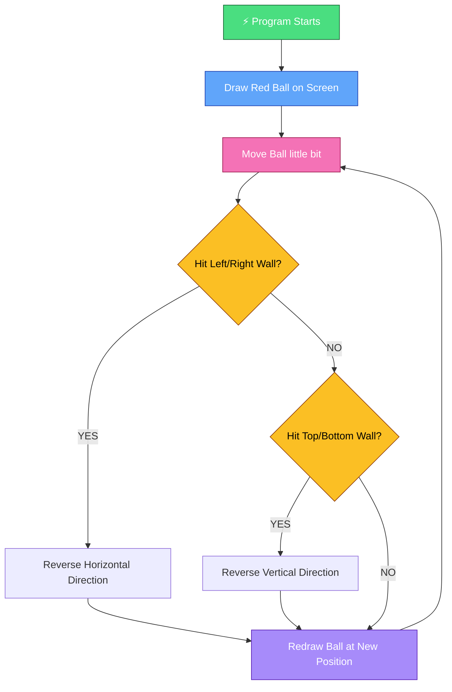

# 🏀 Bouncing Ball (BBall)

## ✨ What is this?
This is the simplest game you will ever understand! It's just a red ball that bounces forever inside a window.

---

## 🎯 How it works (In Plain English)

Imagine you have a box and a rubber ball. If you throw the ball inside:
1.  ✅ Ball moves in one direction
2.  ✅ Ball hits the wall
3.  ✅ Ball bounces back
4.  ✅ This repeats FOREVER

That's EXACTLY what this program does!

---

## 📊 Visual Flow Diagram

This is exactly what happens every single millisecond:



> 💡 The above loop runs **50 TIMES EVERY SECOND**! That's why the ball looks smooth.

---

## 🚀 How Unity would do this EXACT same thing

This program is exactly how games work in Unity, Unreal, Godot - EVERY game engine!

| Step | This Java Program | Unity Game Engine |
|---|---|---|
| 1. | `Timer` runs 50x/second | Unity `Update()` runs 60x/second |
| 2. | `moveBall()` changes position | Your script changes transform.position |
| 3. | If statements check walls | Collider component detects collision |
| 4. | Speed is reversed | Physics material bounciness property |
| 5. | `repaint()` draws ball | Unity renders everything automatically |

### 🎮 Unity Implementation Breakdown

```
If you were to build THIS in Unity:

1.  🟢 Open Unity → Create 2D Project
2.  🟢 Right Click → 2D Object → Sprite → Circle
3.  🟢 Add Component → Rigidbody 2D (turn Gravity = 0)
4.  🟢 Add Component → Box Collider 2D (on all 4 walls)
5.  🟢 Create this 3 line script:
```

```csharp
public class BounceBall : MonoBehaviour {
    public float speed = 5f;

    // Runs every single frame
    void Update() {
        transform.Translate(speed * Time.deltaTime, speed * Time.deltaTime, 0);
    }

    // Runs when ball hits something
    void OnCollisionEnter2D() {
        speed = -speed;
    }
}
```

✅ **EXACT SAME LOGIC!** Just different syntax.

---

## 🧐 What you are actually watching

When you run this program:
- Your screen refreshes 60 times every second
- Each refresh the ball moves 5 pixels
- When it touches the edge, direction flips
- Your eyes can't see the individual steps - you just see smooth motion

---

## 🤔 Why this matters

This is the **FOUNDATION OF ALL VIDEO GAMES**. Every game you have ever played (Minecraft, Fortnite, Candy Crush, everything) is just this same loop, but with more objects:

```
EVERY GAME LOOP EVER:

1.  Check Inputs
2.  Move All Objects
3.  Check Collisions
4.  Draw Everything
5.  REPEAT
```

---

## 🏃‍♂️ How to run this

1.  Open terminal
2.  Go to this folder
3.  Type:
    ```
    javac BBall.java
    java BBall
    ```

---

## 💡 Fun Facts for Students

✅ This entire thing is 65 lines of code
✅ This was how all games were made in the 1980s
✅ Pong is literally this program + 2 paddles + score
✅ All physics engines work on this exact principle
✅ You just learned the core of game development in 5 minutes!

---

> 📌 Remember: **All complexity is just many simple things stacked together**. If you understand this bouncing ball, you understand game programming.